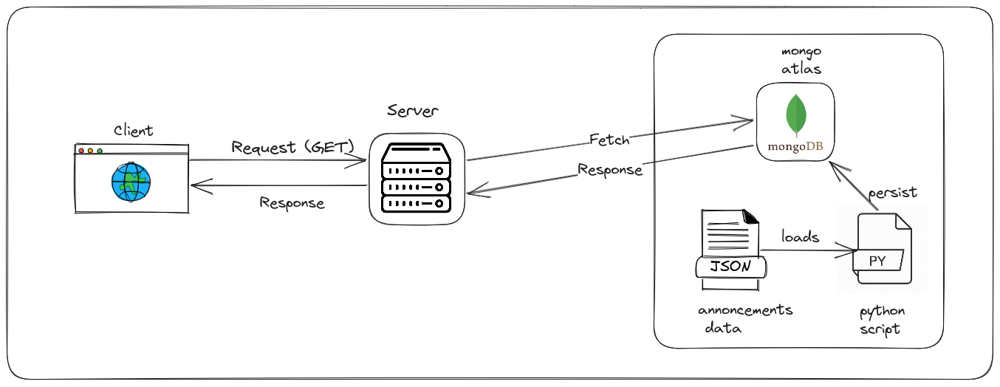

# Project Documentation: Announcement API 

## Problem Statement

Public companies in India are required to regularly update the stock exchanges (e.g., BSE/NSE) about any corporate events that have a high impact on their business or shareholders. These events can include new contracts, changes in management, and other significant developments. As an investor, it's crucial to stay informed about these announcements for the stocks you are interested in.

The problem is to create a backend solution using Next.js/Node.js and MongoDB to handle user requirements related to announcements data. We need to read data from a JSON file containing announcements data and persist it in MongoDB. Then, we should implement various API endpoints to retrieve and manipulate the announcements data.

## Requirements

1. Data Processing:

   - Read data from a given JSON file containing announcements data.
   - Connect to MongoDB and persist the announcements data into the database.

2. API Design and Implementation:
   - API to find announcements of a company (SCRIP_CD) or multiple companies.
   - API to find announcements over a specified period (start & end dates) or announcements of a company/group of companies over a period.
   - API to find all the critical announcements or critical announcements of a list of companies over a given period.
   - API to retrieve announcements from the past 1-2 days in descending time order.

# Solution
## Project Design

| Endpoints                        | Request Type |    Query parameters    |    Description                            | 
| -------------------------------- | :----------: | :--------------------: | :---------------------------------------: | 
| /api/announcements/company       |     GET      |    scripId             |         id of the company                 |
| /api/announcements/company       |     GET      |    startDate,endDate   |   startDate and endDate of announcements  |
| /api/announcements/company       |     GET      |    critical            |    Flag - 1 if the announcement is critical, else 0|
| /api/announcements/company       |     GET      |    recentAnnouncments  |   takes either True or False as params and returns announcements from last 2 days |
| /api/announcements/company       |     GET      |    page                |    page numbers (pagination                 |

> Added pagination to the response of the API.

> If we pass recentAnnouncments with start date & end date then the api only shows announcements from past 2 days  

## Demo Link
https://stockinsights-pi.vercel.app/api/announcements/company
